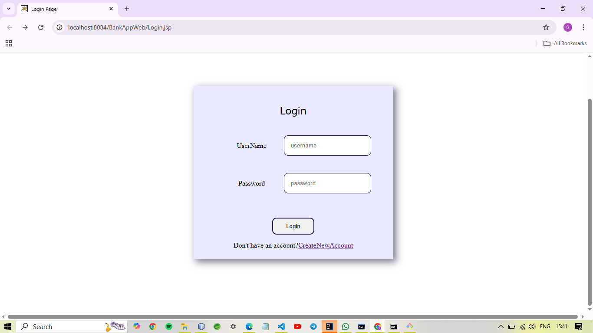
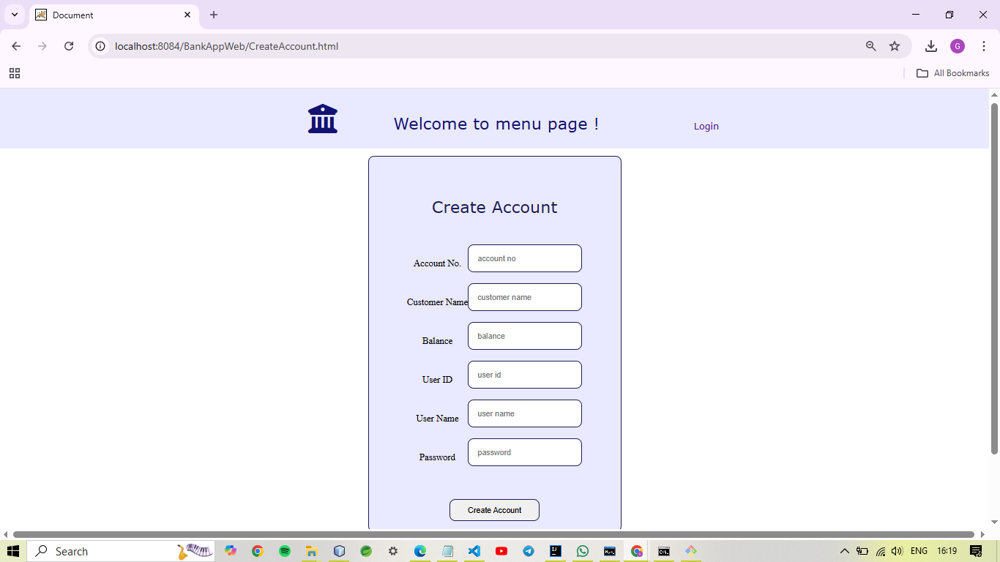
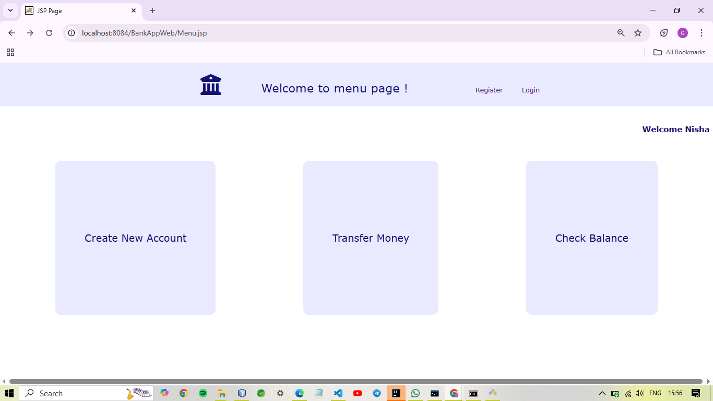
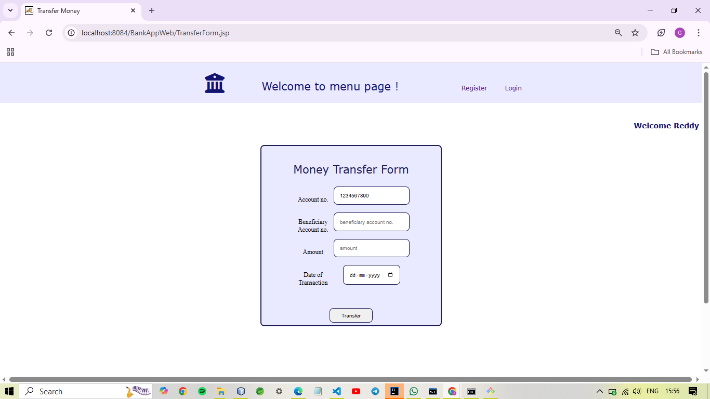
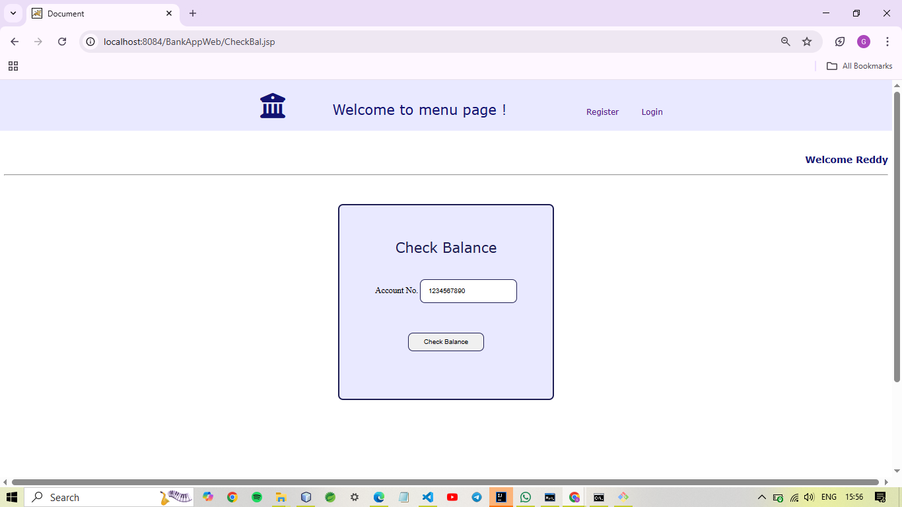

# Banking Web Application
A web-based banking application that provides users with essential banking features like account management, balance tracking, and perform transactions, all from a user-friendly interface.

## Features
- User registration and login
- View account balance
- Transfer money between accounts
- Session tracking
- Create a new account

## Technologies Used
-**Frontend:** HTML, CSS
- **Backend:** Java, JSP, Servlet
- **Database:** MySQL
- **Database Connectivity:** JDBC (Java Database Connectivity)
- **IDE:** NetBeans
- **Other Tools:** Git & GitHub

## Installation & Setup
1. Prerequisites: Ensure the following are installed:
- JDK 8+
- MySQL Server & Workbench
- NetBeans IDE
- Git

2. Clone the Repository: Run the following command on Git Bash
    git clone https://github.com/gouripare11/BankWebApplication.git
    cd bankappGit

3. Set Up the Database: Open MySQL Workbench and create the database:
    CREATE DATABASE march16;
- This database consists of three tables: account_table (consisting user informaton), transfer_table (tracking tranfer details), users (consisting username and password)
- Import the provided .sql file to create tables and data. 

4. Configure JDBC Connection: In the project files update just your password of MySQL int DBUtil.java file in com.gouri.bank.util package
    String url="jdbc:mysql://localhost:3306/march16";
    String un="root";
    String ps="<your mysql password>";
- Also, ensure mysql-connector-java.jar is added to your NetBeans project libraries.

5. Set Up NetBeans Project:
- import the project zip file from Git to NetBeans or simply go to File->Open Project and select the folder
 
6. Run:
- Right click on the Login.jsp page in the Wed Pages folder in the main project file, then click on run.

7. Usage
- The Login page will open
- Start with **clicking on CreateNewAccount** to freshly start with new user
- Enter the required credentials and **click on Create Account** button
- After this, you will be redirected to a page, click on Login on top right of navigation bar
- **Login** with the UserName and Password
- You will be redirected to the Menu page where you can see functionalities of the project.

## Author
**Gouri Pare**
[GitHub Profile] https://github.com/gouripare11

## Screenshots
  ### Login page
      
  ### Create New Account page
      
  ### Menu page
      
  ### Transfer page
      
  ### Check Balance page
      

